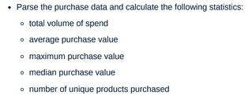

### **1. Project Overview**

#### **Project Title: Purchase Statistics Processing**

This project implements some basic statistical calculations on customer purchase data via a CLI-based application.

The project overview is as follows:
- given the customer purchase data via a JSON files, these data is ingested,
- the data is then transformed as required, for instance duplicates are removed, calculated values are done to make the final statistics calculations easier,
- then the required statistics are obtained,
- and finally output the results in JSON format.

The solution was designed to be adapted to use better scalable tools such as PySpark, with a Dockerized environment for ease of deployment and testing.

### **2. Installation Instructions**

#### **Requirements**

- Docker and Docker Compose
- Python 3.8+
- Additional Python packages listed in `requirements.txt`

#### **Step-by-Step Installation**

1. **Clone the Repository:**

   ```bash
   git clone https://github.com/celicaR/purchases_stats.git
   cd purchases_stats
   ```

   ##### **Project Structure**

   ```plaintext
   .
   ├── Dockerfile
   ├── Makefile
   ├── README.md
   ├── data
   │   ├── purchases_v1.json
   │   └── sample_purchases.json
   ├── docker-compose.yml
   ├── pyproject.toml
   ├── requirements.txt
   ├── scripts
   │   ├── code_validation.sh
   │   ├── docker_run.sh
   │   ├── down.sh
   │   ├── py_env_setup.sh
   │   └── pytest.sh
   ├── src
   │   ├── __init__.py
   │   └── purchases_stats.py
   ├── test.py
   └── tests
      ├── __init__.py
      ├── test_data
      │   ├── empty_purchases.json
      │   ├── invalid_purchases.json
      │   ├── sample_purchases.json
      │   └── valid_purchases.json
      └── test_purchases_stats.py
   ```

   ##### **Project Structure, directories and key files**
   - `src/`: Source code for processing purchases.
   - `tests/`: Unit tests.
   - `data/`: Sample data files.
   - `scripts/`: Helper scripts for running tasks.

1. **Local Development:**

   1. **Set Up the Local Environment:**

      In order to run and/or develop the solution locally then a python virtual env needs to be set up by running this command: `make setup`

      Ensure that the necessary environment variables are defined in the `.env` file when required.

   1. **Running the Application:**

      To run the application from the terminal: `python3 src/purchases_stats.py data/purchases_v1.json`

   1. **Testing and Validating the Application:**

      To run the unit tests from the terminal: `pytest`

      To validate the code via linting, using **black** and formatting, using **ruff** run: `make validation`

### **3. Usage**

#### **Processing Purchase Data**

You can process the purchase data and calculate the required statistics using the following command:

##### Locally:
```bash
python3 src/purchases_stats.py data/purchases_v1.json
```

##### Docker:
```bash
make run json_file_path=data/purchases_v1.json
```
OR
```bash
docker-compose run --rm app data/purchases_v1.json
```

The processed results will be output to `STDOUT` in JSON format. Here are a sample of the resulting values output:


<details>
<summary> Click to see requirements</summary>

### Requirements:

Here is the list of other requirements for the project to solve:

| Requirement | Description | Outcome |
|-------------|-------------|---------|
|CLI application|The application can be executed in the terminal/CLI. | Both the application can run locally and/or via docker and make commands from the CLI. See Docker Deployment commands.        |
|Input File     |Allow input of purchases via a file, containing data in the JSON format. | The JSON file path has to be specified as an argument in all cases, i.e. locally, docker, make commands. |
|Required statistics & Print results to STDOUT in a JSON format |             |         |
</details>


<details>
<summary> Click to see assumptions</summary>

### Assumptions:

The hint given was that purchase value will need to be computed.

Based on a sample of the given purchases JSON file (see [data/sample_purchases.json](data/sample_purchases.json){:target="_blank"}), these data once ingested was transformed by removing duplicates and normalized its items.

Then each items product value (`item.product_value`) in a purchase done by a customer was calculated as -> `item.price * item.quantity`, producing the data as shown in this picture:


Then assumption was to do the purchases statistics for a brand, customer_id and purchase_id on:


Resulting on these values output:


</details>

### **4. Deployment**

#### **Docker Deployment**

   The application has been dockerized. Please note most docker commands have been associated with `make` commands for ease of use.

   | Command | Description |
   |---------|-------------|
   |`make build`| To create the required Docker images and containers.|
   |`make run json_file_path=data/purchases_v1.json`| To run the application with the given JSON data file. |
   |`make test` |To run the unit tests for the application.       |
   |`make validation` |To validate the code via linting, using **black** and formatting, using **ruff**.|
   |`make start`|To validate the code, perform unit tests, create the required images and containers, and the application. |
   |`make stop` |To stop and clean any docker images and containers.       |
   |`docker-compose logs -f` |To view the logs and ensure the application is running.       |
   |`make help` |To view `make` commands available.       |

### **5. Additional Information**

#### **Further Extensions**

- **Scaling with Spark:** For large datasets, leverage PySpark to handle big data processing efficiently.
- **Airflow DAG Enhancements:** Extend the solution to orchestrate the tasks as part of a DAG with more sophisticated task dependencies and monitoring.
- **dbt Models:** Use dbt to transform and model data in a data warehouse environment.

#### **Troubleshooting**

- **Docker Issues:** Ensure Docker is running and that your system meets the minimum requirements.
- **Environment Variables:** Verify that the `.env` file contains all necessary variables.

### **Summary**

This documentation provides a comprehensive guide to setting up, running, and extending the purchase statistics processing project. It includes installation instructions, usage guidelines, testing and linting procedures, deployment steps, and additional resources for troubleshooting the project.
